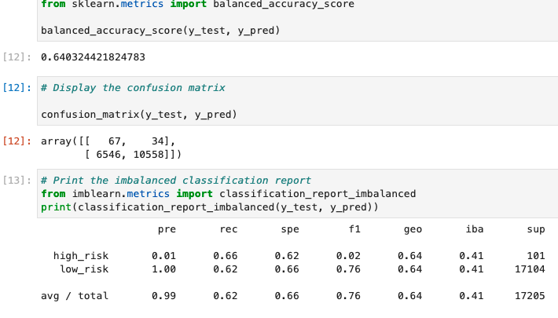
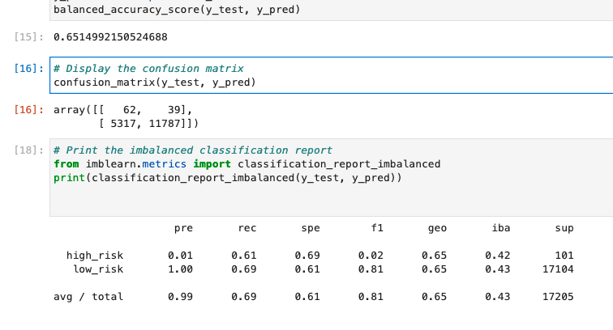
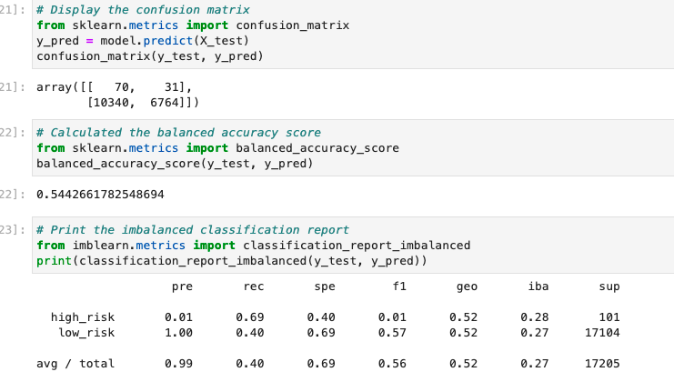
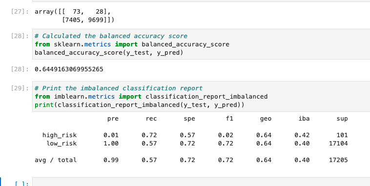
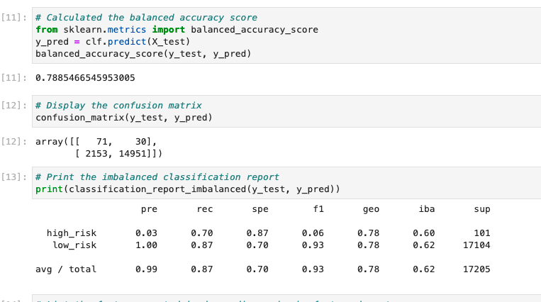
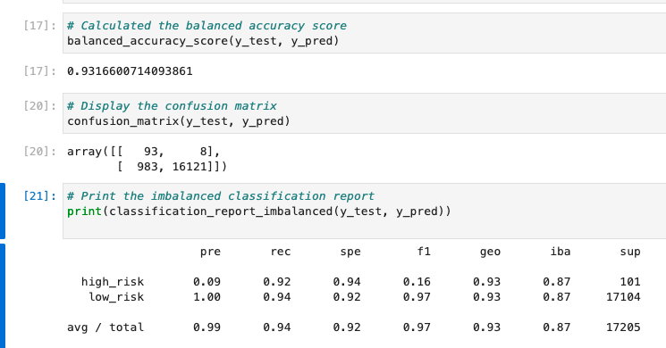

# Credit Risk Analysis

## Overview
* The overview of the analysis we did on credit risk was to use supervised machine learning to see how well we can detect credit card fraud.
* Using six different methods, we are trying to find the best algorithm for detecting fraud.
* For catching fraud, we value precision over sensitivity.

## Results

### Over Sampling
* We tried two methods of oversampling: Naive Random, and Smote

*   
* 	The naive random sampling model got a balance accuracy score of .640, a .99 precision score and a .62 recall score.
*  
*  The smote oversampling model received a balance score of .651, a .99 precision score and a .69 recall score.

### Undersampling
* 
* For undersampling, we used the ClusterCentroids resampler. This model received a .544 balanced accuracy score, a .99 precision and a .40 recall score.

### Combination (Over and Under) Sampling
* 
* The Smoteenn model recieved a balanced accuracy score of .645, a .99 precision score and a .62 recall score.

### Ensemble Learners
* For ensemble learners, we used Balanced Random Forest Classifier and Easy Ensemble AdaBoost Classifier.
* 
* Balanced Random Forest got a Balance Accuracy Score of .789, with a .99 precision and a .87 recall.
* 
* The Easy Ensemble AdaBoost Classifier received a .932 balanced accuracy score, a .99 precision score and a .94 recall score.

## Summary
* To detect credit card fraud we used 6 different types of algorithm model's to find which model would work the best in supervised learning.
* After our report, we have decided the best model is the Easy Ensemble Adaboost Classifier. This model had the highest balanced score of .932 and a .94 recall score. We feel this model would work best for detecting fraud.
